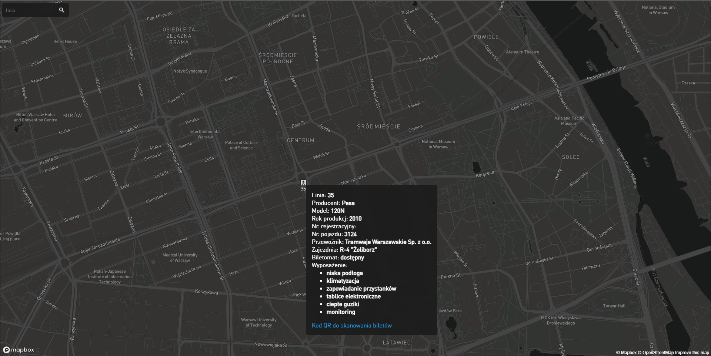

# V1

## discovery

Around March 2021, I was looking around the gov open data website and discovered that the city of Warsaw (Which is where I live) has an open [API](http://api.um.warszawa.pl/).

The resource that I found the most interesting was [buses and trams online](https://api.um.warszawa.pl/files/9fae6f84-4c81-476e-8450-6755c8451ccf.pdf).

## first app

The first thing I did, was creating a NodeJS app that fetches the API for buses then logs in console links to their positions on google maps. 

It worked fine, but I thought that websites are way cooler than console applications and that maps are better than links to maps, so I started making them.

## first website

I decided to use Express in which I had almost no experience at the time,
so I started watching tutorials.

After some time, I've finally made the first website.

It wasn't much, but I had to start somehow.

## adding maps

The best way to display a list of geographical coordinates is a map, so that's what I added.

I went with Mapbox, mainly because of [this video](https://youtu.be/OySigNMXOZU).

After some time, I finally got the data onto maps!

## adding features

One of the first things I added was searching for lines.

Another one was a dropdown list of all the results found.

The most challenging feature I added was getting bus details.

### Getting bus details
The most challenging part of this was that there's no API for that details, so I had to scrape. I used jsdom.
To get bus details, I had to:

>do a GET request to https://www.ztm.waw.pl/en/vehicle-database/ searching for a bus of a given id

>get the first results href

>execute a GET request to the href 

>read the tables

## End of V1

V1 got finished

here's how it looks

I would agree with you if you said that it's ugly.

# V2

### Why?

Because I wanted to learn TypeScript

### When? 

around the end of June 2021

## Redoing

redoing ZtmGeo in typescript was pretty simple, mainly because programming is mostly about thinking, not about writing code

## Improving

This time I made it so you can also track trams,
decided to make it dark-themed,
removed unnecessary things,
making points on map clickable,
making it a PWA

## Finished (for now) V2

here's how V2 looks

I think it looks much better than V1.

# if you disagree, then :'(